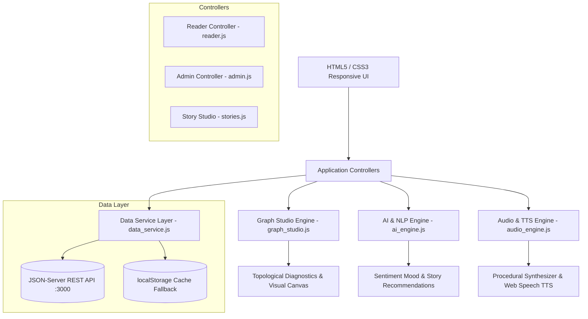

# 🌌 Dynamic Story Engine (Story Branching Universe)

> **AI-Powered Interactive Branching Story Engine with Directed Graph Theory Analytics, Procedural Ambient Soundscapes, and Gamified Reader Progression.**

---

## 📌 Table of Contents
- [🎯 Project Aim](#-project-aim)
- [🎯 Key Objectives](#-key-objectives)
- [✨ Core Features](#-core-features)
- [⚙️ Detailed Functionalities](#️-detailed-functionalities)
  - [1. Immersive Reader Engine](#1-immersive-reader-engine)
  - [2. Graph Studio & Narrative Topology](#2-graph-studio--narrative-topology)
  - [3. AI / NLP Intelligence Subsystem](#3-ai--nlp-intelligence-subsystem)
  - [4. Procedural Audio & Ambient Engine](#4-procedural-audio--ambient-engine)
  - [5. Admin & Story Creator Studio](#5-admin--story-creator-studio)
  - [6. Authentication & User Profile System](#6-authentication--user-profile-system)
- [🏗️ System Architecture & Data Model](#️-system-architecture--data-model)
- [💻 Technology Stack](#-technology-stack)
- [📂 Project Structure](#-project-structure)
- [🚀 Getting Started & Installation](#-getting-started--installation)
- [🔮 Future Roadmap](#-future-roadmap)
- [📜 License](#-license)

---

## 🎯 Project Aim

The primary **Aim** of the **Dynamic Story Engine** is to redefine digital non-linear storytelling by bridging creative prose with **discrete mathematics (Directed Acyclic Graphs)**, **real-time Natural Language Processing (NLP)**, and **procedural Web Audio/Speech synthesis**.

Traditional interactive fiction often suffers from narrative dead-ends, disconnected plotlines, and static presentation. The Dynamic Story Engine solves these challenges by providing:
1. An **intuitive, visual authoring studio** with topological mathematical validation that prevents dead ends and circular logic flaws.
2. A **sensory, immersive reading platform** that reacts to the emotional atmosphere of the narrative in real time via ambient lighting, procedural generative soundscapes, and AI voice narration.
3. A **gamified reader community** where choices carry weight, journeys are chronicled and exportable, and reader progression is rewarded with experience points (XP) and achievement badges.

---

## 🎯 Key Objectives

- **Non-Linear Graph Modeling:** Formulate interactive stories as directed graphs $G = (V, E)$, where vertices $V$ represent narrative scenes/nodes and directed edges $E$ represent player choices.
- **Topological Integrity & Graph Diagnostics:** Implement algorithms (DFS, cycle detection, in-degree/out-degree audits, entropy analysis) to verify story coherence and structural health.
- **Emotion & Atmosphere Synchronization:** Extract emotional tone (thrill, suspense, heroism, melancholy, peace, danger) dynamically from narrative text using lexical NLP to drive dynamic visual glows and audio soundscapes.
- **Procedural Audio & Accessibility:** Integrate the Web Audio API for synthetic chord/drone generation and the Web Speech API (TTS) for natural voice storytelling.
- **State Checkpoints & Time-Warp Mechanics:** Deliver flexible checkpoint persistence (multi-slot saving/loading) and an XP-based "Time-Warp Retreat" mechanic allowing players to undo fatal decisions.
- **Role-Based Content Administration:** Provide separated, authenticated workflows for Readers (exploration, ratings, progress tracking) and Admins/Authors (visual graph editing, story cloning, node linking, AI scene co-piloting).
- **Resilient Offline-First Architecture:** Ensure persistent data flow using a synchronized hybrid storage model combining a local mock REST API (`json-server`) with fallback browser caching (`localStorage`).

---

## ✨ Core Features

| Feature | Description |
| :--- | :--- |
| **Interactive Graph Traversal** | Dynamic node-by-node decision making with multiple ending classifications (Good, Neutral, Tragic, Catastrophic). |
| **Real-Time Graph Minimap** | Interactive canvas overlay displaying the entire story topology and highlighting the reader's live traversal route. |
| **AI Emotion Atmosphere Glow** | Ambient background lighting dynamically shifts colors to reflect the scene's emotional sentiment. |
| **Procedural Soundscapes** | Generative multi-oscillator synthesizer producing mood-matched background audio without external audio files. |
| **Text-to-Speech (TTS) Narrator** | Built-in AI voice reading scenes aloud with real-time speech controls (rate, pitch, voices). |
| **Visual Graph Studio** | Dual-view authoring workspace switching seamlessly between structured cards and interactive canvas node graphs. |
| **Automated Graph Validator** | Mathematical diagnostic audit catching unreachable nodes, broken target edges, loops, and terminal dead-ends. |
| **Time-Warp & Checkpoints** | Multi-slot timeline saving and an XP-cost undo system to backtrack without restarting the entire story. |
| **Journey Chronicle Exporter** | Generates formatted step-by-step transcripts of the reader's path, exportable as JSON or formatted text. |
| **Community Ratings & Reviews** | Interactive feedback system allowing readers to leave 5-star ratings and written reviews. |
| **Gamified Reader XP System** | Readers earn XP, unlock ranks (Novice → Master Storyteller), and collect achievement badges. |

---

## ⚙️ Detailed Functionalities

### 1. Immersive Reader Engine
- **Dynamic Scene Rendering:** Reads scene data including title, prose, location tag, character lists, and custom choices.
- **Branching Decision Pathway:** Presents interactive choice pills leading to new narrative branches.
- **Story Minimap Modal:** Live 2D topological graph rendering showing current node position, visited nodes, and ending destinations.
- **Timeline Checkpoints (Save/Load):** Multiple save slots allowing readers to bookmark critical narrative forks and reload later.
- **Time-Warp Retreat:** Allows readers to step back to previous scenes at the cost of player XP.
- **Journey Chronicle:** Comprehensive narrative log that tracks every choice made, calculate total traversal depth, and enables one-click download/clipboard copying.

### 2. Graph Studio & Narrative Topology
- **Dual Authoring Mode:**
  - *Card View:* Rapid form-based creation of scene nodes, choices, character tags, and ending flags.
  - *Canvas View:* Interactive visual node graph displaying connected edges with color-coded node states (Start = Gold, Scene = Blue, Good Ending = Emerald, Tragic Ending = Crimson).
- **Mathematical Structural Audit:**
  - Calculates Total Nodes, Edges, Average Branching Factor, and Narrative Entropy.
  - Detects unreachable orphan nodes and broken edge targets.
  - DFS-based loop and cycle detector for maintaining DAG compliance.
- **Cascading Deletions:** Deleting a scene automatically cleans up all corresponding choice edges referencing it across the entire story.

### 3. AI / NLP Intelligence Subsystem
- **Sentiment & Emotion Analysis:** Lexical parsing categorizes scene narrative into emotional vectors (Thrilling, Suspenseful, Heroic, Melancholy, Peaceful, Dangerous).
- **Content Atmosphere Injection:** Dynamically adjusts page glow gradients and CSS variables to match the mood of the text.
- **AI Narrative Co-Pilot:** Generates narrative continuation prompts and suggests branching choice options for authors.
- **Content Recommendation Engine:** Computes cosine similarity across story descriptions, genres, and user reading history to recommend related adventures.

### 4. Procedural Audio & Ambient Engine
- **Web Audio API Procedural Synthesizer:** Real-time synthesis of soundscapes (Cyberpunk Drone, Mystery Harmonics, Tension Pulse, Ethereal Peace, Victory Chords) using dual oscillators, low-pass biquad filters, and gain ramps.
- **AI Voice Narration (TTS):** Uses the Web Speech API to read scene narrative aloud, automatically adjusting cadence and stopping upon scene transition.

### 5. Admin & Story Creator Studio
- **Full Story Lifecycle (CRUD):** Create, edit, preview, publish, and delete story universes.
- **Deep Story Cloning:** Duplicates entire story graphs with freshly generated node and choice IDs for easy template branching.
- **Preset Cover Selector:** Built-in curated cover art library for genres (Adventure, Cyberpunk, Sci-Fi, Fantasy, Mystery, Horror).
- **Live Publishing Status:** Toggle between `draft` and `published` states.

### 6. Authentication & User Profile System
- **Role-Based Access Control (RBAC):** Separate interfaces and permission tiers for `Reader` and `Admin` users.
- **User Progression Tracker:** Tracks user XP, story completion records, level badges, and saved checkpoints in persistent storage.
- **Session Management:** Secure local credential validation with seamless redirection guards.

---

## 🏗️ System Architecture & Data Model



### Data Schema Overview
- **User:** `{ id, name, email, password, role, xp, completedStories, savedGames }`
- **Story:** `{ id, title, author, authorId, genre, status, description, imageURL, startNodeId, nodes: [ Node ] }`
- **Node:** `{ id, title, text, location, characters: [], isEnding, endingType, choices: [ Choice ] }`
- **Choice:** `{ id, text, targetNodeId }`
- **Review:** `{ id, storyId, userId, userName, rating, comment, date }`

---

## 💻 Technology Stack

- **Frontend Core:** HTML5, Modern CSS3 (Neo-Brutalist design tokens, Glassmorphism, Responsive Grid/Flexbox), Vanilla JavaScript (ES6+ Classes, Async/Await).
- **Visuals & Canvas:** HTML5 2D Canvas API for topological graph and minimap rendering.
- **Audio & Speech:** Web Audio API (Procedural Oscillator/Gain synthesis), Web Speech API (`window.speechSynthesis`).
- **Typography:** Google Fonts (`Bowlby One`, `Outfit`, `Plus Jakarta Sans`).
- **Backend / Persistence:** `json-server` (Local REST API Mocking) with automatic `localStorage` synchronization.

---

## 📂 Project Structure

```text
Story_Branching/
│
├── Story_Branching/
│   └── Authentication/
│       ├── Landing.html            # Public marketing landing page & feature showcase
│       ├── index.html              # Entry redirector
│       ├── package.json            # Dependencies & start scripts (json-server)
│       ├── db.json                 # Persistent database (Users, Stories, Reviews)
│       │
│       ├── css/                    # Custom stylesheets
│       │   ├── style.css           # Global core styles
│       │   ├── login.css           # Login screen styles
│       │   ├── signup.css          # Registration screen styles
│       │   ├── reader.css          # Reader library & gameplay UI
│       │   ├── admin.css           # Admin dashboard styles
│       │   └── stories.css         # Visual story editor styles
│       │
│       ├── js/                     # Modular JavaScript engines
│       │   ├── data_service.js     # Data access layer with offline sync
│       │   ├── ai_engine.js        # Lexical sentiment analysis & NLP recommendations
│       │   ├── graph_studio.js     # Directed graph diagnostics & canvas renderer
│       │   ├── audio_engine.js     # Web Audio synth & Web Speech TTS
│       │   ├── login.js            # Login authentication handling
│       │   ├── signup.js           # Registration handling
│       │   ├── reader.js           # Reader interface & game state engine
│       │   ├── admin.js            # Admin analytics & story manager
│       │   └── stories.js          # Graph editor & story authoring controller
│       │
│       └── pages/                  # Application views
│           ├── auth/
│           │   ├── login.html      # User / Admin login page
│           │   └── signup.html     # User registration page
│           ├── admin/
│           │   ├── admin.html      # Admin dashboard & analytics
│           │   └── add_stories.html# Dual-mode Story & Graph Studio
│           └── reader/
│               ├── stories.html    # Story library & community universes
│               └── play.html       # Immersive interactive story player
│
└── README.md                       # Comprehensive Project Documentation
```

---

## 🚀 Getting Started & Installation

### 1. Prerequisites
- [Node.js](https://nodejs.org/) (version 16.x or higher)
- Modern web browser (Chrome, Edge, Firefox, Safari)

### 2. Clone or Navigate to the Workspace
```bash
cd d:/Story_Branching/Story_Branching/Authentication
```

### 3. Install Dependencies
```bash
npm install
```

### 4. Start the Backend Server
Launch the local `json-server` database:
```bash
npm run server
```
*The REST API will run at `http://localhost:3000`.*

### 5. Launch the Application
Open `Landing.html` in your favorite browser or use Live Server in VS Code / Antigravity IDE:
```text
http://localhost:5500/Story_Branching/Authentication/Landing.html
```

### 6. Default Credentials
| Role | Email | Password |
| :--- | :--- | :--- |
| **Admin** | `admin@gmail.com` | `admin123` |
| **Reader** | `testreader@example.com` | `password123` |

---

## 🔮 Future Roadmap

- [ ] **Multiplayer Cooperative Branching:** Enable multiple readers to vote on choices in real time via WebSockets.
- [ ] **Direct LLM Integration:** Connect OpenAI / Gemini API endpoints for live procedural branch generation.
- [ ] **Rich Media Nodes:** Support inline scene video, 3D Canvas scenes (Three.js), and custom audio tracks per node.
- [ ] **Story Import/Export (Twine / Ink):** Support standard `.twee` and Ink format importing and exporting.

---

## 📜 License

This project is open-source and available under the **MIT License**.
